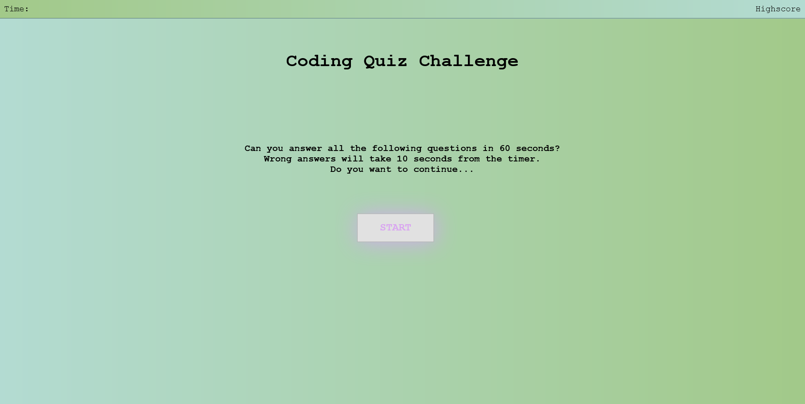

# Coding Quiz Challenge
### Description:
This is an 8 question coding quiz with a timer of 60 seconds. Every incorrect answer will cost -10 seconds in the timer. Your score will be stored, and multiple attempts are allowed.

### Notes:
This is my first attempt on creating a quiz using `DOM` elements to manipulate HTML elements. Unfortunately, the code became very repetitive, I could've done this using arrays and objects with so much fewer code. The quiz has flaws in it, and it's really not suitable for public usage. While building this quiz, I've learned so much from researching and troubleshooting. In the future, if I do anything with `DOM` elements again, I will have a much better approach to constructing the base of the program.

### Issues:
- *localStorage* sometimes duplicating high-score printout.
- Since every incorrect answer is -10 seconds, the score goes negative numbers.
- Layout of quiz too funky.

### Webpage:
https://kemaldemirgil.github.io/code-quiz/

### License:

Copyright © Kemal Demirgil. All rights reserved.
Licensed under the [MIT](https://github.com/kemaldemirgil/code-quiz/blob/main/LICENSE) license.
